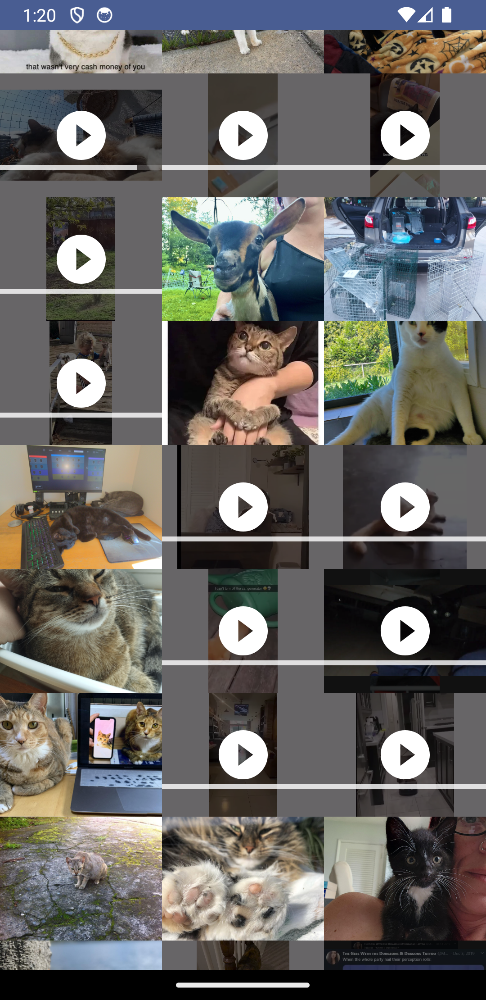

### Gallery é um aplicativo para exibição de imagens e vídeos, utilizando como fonte de dados a API do site [Imgur](https://imgur.com)

O Gallery é um aplicativo Android construído com: 
- Linguagem Kotlin 
- Jetpack Compose, recomendado para UI Nativas
- Retrofit, Biblioteca recomendanda pela Google para consumos de API´s
- GSON, Biblioteca da Google para lidar com dados no formato JSON
- Coroutines, para executar código de forma assíncrona(utilizei no consumo da API)
- StateFlow, para observar as mudanças de estados dos dados
- Koin, para injetar dependências
- Coil, para carregar imagens a partir de URL´s
- Arquitetura MVVM, Model View ViewModel

